

  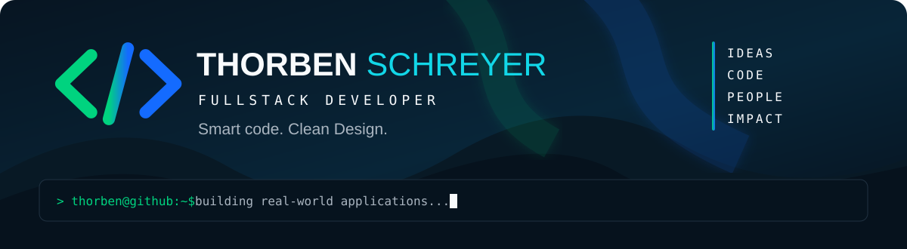

  

  
  
  

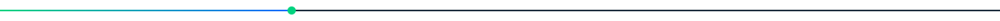

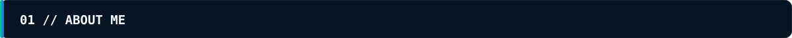

┌─ DEVELOPER_PROFILE ──────────────────────────────────────────┐
│ NAME       Thorben Schreyer                                  │
│ ROLE       Fullstack Developer in Progress                   │
│ SECOND     Berufsfeuerwehrmann                               │
│ STATUS     ● BUILDING                                        │
└──────────────────────────────────────────────────────────────┘

Ich entwickle moderne Webanwendungen und Softwaresysteme und erweitere meine Kenntnisse vor allem durch eigene, reale Projekte.

Mein Ziel ist nicht, Technologien einfach nur kennenzulernen. Ich möchte verstehen, wie aus einer Idee eine vollständige Anwendung entsteht – von Datenmodell und Business-Logik bis zum Interface.

Neben der Softwareentwicklung arbeite ich als Berufsfeuerwehrmann. Teamarbeit, Verantwortung, strukturiertes Handeln und Problemlösung gehören deshalb genauso zu meinem Alltag wie TypeScript, Angular und Git.

Smart code. Clean Design.

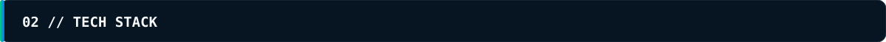

  

FRONTEND                 BACKEND & DATA             DEVELOPMENT
├─ Angular               ├─ Supabase                ├─ Git
├─ TypeScript            ├─ PostgreSQL              ├─ GitHub
├─ JavaScript            ├─ Firebase                ├─ VS Code
├─ HTML                  ├─ REST APIs               └─ Linux
└─ CSS / SCSS            └─ Realtime

<b>◉ CURRENTLY EXPLORING</b>

 

Python · Django · n8n · Swift · Apple Ecosystem

 

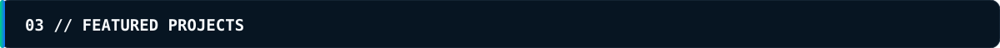

TAS ELS

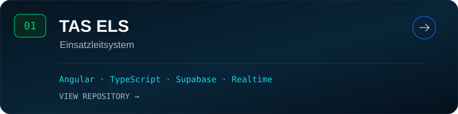

Modulares Einsatzleitsystem für Organisationen und Einsatzkräfte. Das Projekt verbindet Angular, TypeScript, Supabase, Datenmodellierung, Realtime-Kommunikation und komplexere Anwendungslogik.

<b>▸ TAS ELS / PROJECT DETAILS</b>

TAS ELS
├─ Einsätze
├─ Ressourcen & Fahrzeuge
├─ Einheiten & Einsatzkräfte
├─ Alarmierung & Rückmeldungen
├─ Mobile Einsatzbearbeitung
├─ Patientendokumentation
└─ Live-Einsatzmonitor

Frontend: Angular · TypeScript · Reactive Forms · Signals
Backend: Supabase · PostgreSQL · Authentication · Realtime · RLS

Weitere Projekte

<a href="https://github.com/thorbenschreyer/join-3125">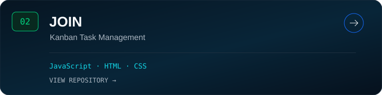</a>
<a href="https://github.com/thorbenschreyer/el_pollo_loco">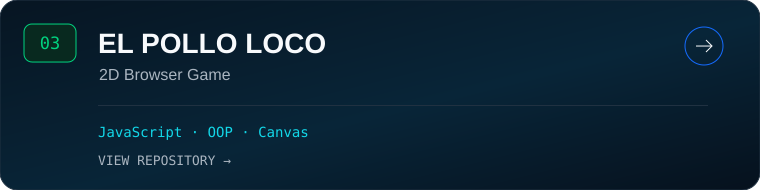</a>

<a href="https://github.com/thorbenschreyer/PokeIndex">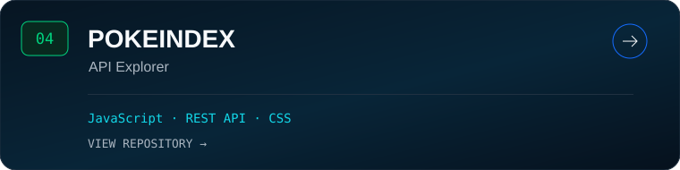</a>
<a href="https://github.com/thorbenschreyer/Kochwelt-2477">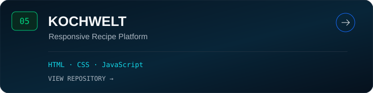</a>

 

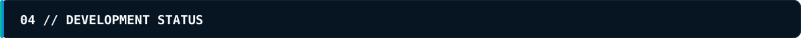

ANGULAR       ● ACTIVE
TYPESCRIPT    ● ACTIVE
SUPABASE      ● ACTIVE
POSTGRESQL    ● ACTIVE

PYTHON        ◌ EXPLORING
DJANGO        ◌ EXPLORING
N8N           ◌ EXPLORING
SWIFT         ◌ EXPLORING

CURRENT MISSION
> Build larger real-world applications
> Improve software architecture
> Connect frontend and backend
> Build clean and scalable interfaces

STATUS: ONLINE_

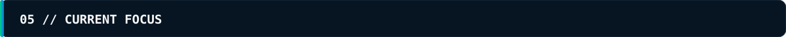

+ Angular Architecture
+ TypeScript
+ Reactive Forms & Signals
+ Supabase & Realtime
+ Database Design
+ UI / UX
+ Fullstack Development

> Python / Django
> Automation with n8n
> Swift & Apple Ecosystem

<b>▸ BEYOND CODE</b>

 

Berufsfeuerwehr — Verantwortung · Teamwork · Kommunikation · Entscheidungen
Software Development — Architektur · Debugging · Lernen · Bauen

Analysieren. Entscheiden. Umsetzen. Verbessern.

 

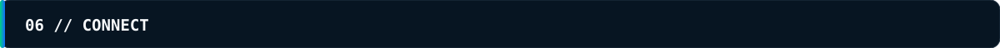

  <b>LET'S BUILD SOMETHING.</b>
    
  <a href="https://tas-development.com">Website</a>
  &nbsp; · &nbsp;
  <a href="https://www.linkedin.com/in/thorben-ansgar-schreyer-040977301/">LinkedIn</a>
  &nbsp; · &nbsp;
  <a href="mailto:info@tas-development.de">E-Mail</a>
    
  <b>&lt;/&gt; TAS DEVELOPMENT</b> 
  Smart code. Clean Design.  
  <i>Better Software. A Brighter Tomorrow.</i>

